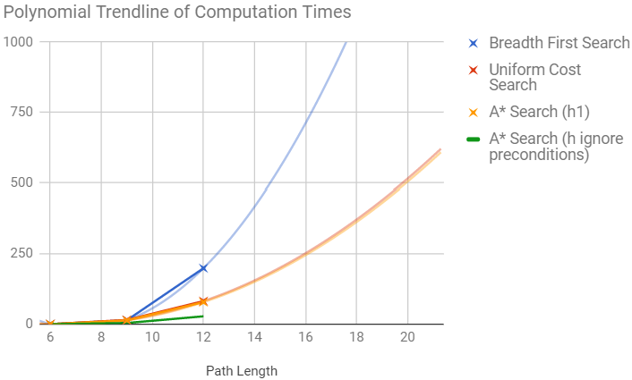
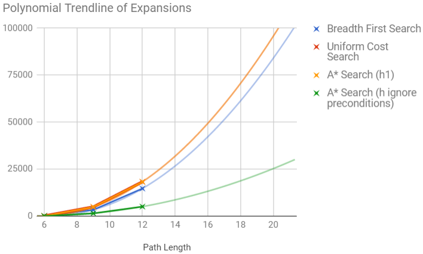

# Udacity Artificial Intelligence Nanodegree
## Planning Search
> Author: Ke Zhang
>
> Submission Date: 2017-07-04 (Revision 1)
 
## Analysis of the Air Cargo Transport Heuristics
 
### Synopsis
 
This paper briefly explains how does our planning search agent solve the deterministic logistics planning problems for an Air Cargo transport system and compares and contrasts the performance of both uninformed and heuristic-based search strategies.

### Planning Search Agent and Planning Problems

In the planning search agent implementation, a planning graph is used to provide automatic domain-independent admissible heuristics (e.g. _A* search_). Their performance are then compared against several uninformed non-heuristic search methods (a.k.a. blind search e.g. _breadth-first search_) in the selected planning problems. 

Three planning problems from the Air Cargo domain are to be analyze. The problems are defined in classical PDDL (Planning Domain Definition Language). They share the common action schema '_Load_', '_Unload_' and '_Fly_'. The initial states and goals of the problems and the suggested sample solutions by the agent with the optimal plan lengths are listed in the table below. (In each case, the suggested plan is chosen from the best overall search method selected from the next performance comparison chapter.)

<table>
    <thead>
        <tr>
            <th colspan="2">Problem 1</th> 
        </tr>
    </thead>
    <tbody>
        <tr>
            <th>Initial States and Goals</th>
            <th>Optimal Plan</th>
        </tr>
        <tr>
            <td>
                <pre>
    Init(
        At(C1, SFO) ∧ At(C2, JFK) ∧ 
        At(P1, SFO) ∧ At(P2, JFK) ∧
        Cargo(C1) ∧ Cargo(C2) ∧ 
        Plane(P1) ∧ Plane(P2) ∧ 
        Airport(JFK) ∧ Airport(SFO)
    )
    Goal(At(C1, JFK) ∧ At(C2, SFO))
                </pre>
            </td>
            <td>
                <pre>
    Load(C1, P1, SFO)
    Load(C2, P2, JFK)
    Fly(P1, SFO, JFK)
    Fly(P2, JFK, SFO)
    Unload(C1, P1, JFK)
    Unload(C2, P2, SFO)
                </pre>
            </td>
        </tr>
    </tbody>
    <thead>
        <tr>
            <th colspan="2">Problem 2</th> 
        </tr>
    </thead>
    <tbody>
        <tr>
            <th>Initial States and Goals</th>
            <th>Optimal Plan</th>
        </tr>
        <tr>
            <td>
                <pre>
Init(
    At(C1, SFO) ∧ At(C2, JFK) ∧ At(C3, ATL) ∧ 
    At(P1, SFO) ∧ At(P2, JFK) ∧ At(P3, ATL) ∧ 
    Cargo(C1) ∧ Cargo(C2) ∧ Cargo(C3) ∧ 
    Plane(P1) ∧ Plane(P2) ∧ Plane(P3) ∧
    Airport(JFK) ∧ Airport(SFO) ∧ Airport(ATL)
)
Goal(At(C1, JFK) ∧ At(C2, SFO) ∧ At(C3, SFO))
                </pre>
            </td>
            <td>
                <pre>
Load(C3, P3, ATL)
Fly(P3, ATL, SFO)
Unload(C3, P3, SFO)
Load(C2, P2, JFK)
Fly(P2, JFK, SFO)
Unload(C2, P2, SFO)
Load(C1, P1, SFO)
Fly(P1, SFO, JFK)
Unload(C1, P1, JFK)
                </pre>
            </td>
        </tr>
    </tbody>
    <thead>
        <tr>
            <th colspan="2">Problem 3</th> 
        </tr>
    </thead>
    <tbody>
        <tr>
            <th>Initial States and Goals</th>
            <th>Optimal Plan</th>
        </tr>
        <tr>
            <td>
                <pre>

Init(
    At(C1, SFO) ∧ At(C2, JFK) ∧ At(C3, ATL) ∧ At(C4, ORD) ∧ 
    At(P1, SFO) ∧ At(P2, JFK) ∧ 
    Cargo(C1) ∧ Cargo(C2) ∧ Cargo(C3) ∧ Cargo(C4) ∧ 
    Plane(P1) ∧ Plane(P2) ∧ 
    Airport(JFK) ∧ Airport(SFO) ∧ Airport(ATL) ∧ Airport(ORD)
)
Goal(At(C1, JFK) ∧ At(C3, JFK) ∧ At(C2, SFO) ∧ At(C4, SFO))
                </pre>
            </td>
            <td>
                <pre>
Load(C2, P2, JFK)
Fly(P2, JFK, ORD)
Load(C4, P2, ORD)
Fly(P2, ORD, SFO)
Unload(C4, P2, SFO)
Load(C1, P1, SFO)
Fly(P1, SFO, ATL)
Load(C3, P1, ATL)
Fly(P1, ATL, JFK)
Unload(C3, P1, JFK)
Unload(C2, P2, SFO)
Unload(C1, P1, JFK)
                </pre>
            </td>
        </tr>
    </tbody>
</table>

### Performance Comparison
 
Below are the performance metrics of the different search methods for each planning problem grouped by uninformed and heuristic-based search. The performance is compared in terms of execution time, memory usage (expansions and nodes) and path lengths. The optimal search method should have the optimal path length and the least execution time with acceptable memory usage. We value time over memory because the computational power is usually the bottleneck when calculating the search plans in our test environment.

#### _Problem 1_ 

##### Result Matrix

| # 1 | __Search Method__ 2 | __Expansions__ | __Goal Tests__ | __New Nodes__ | __Time__ | __Length__ 3 |
| --- | --- | --- | --- | --- | --- | --- |
| 1 | _Breadth First Search_ (U) | 43 | 56 | 180 | 0.025s | __<u>6</u>__ |
| 2 | _Breadth First Tree Search_ (U) | 1458 | 1459 | 5960 | 0.753s | __<u>6</u>__ |
| 3 | _Depth First Graph Search<_ (U) | 12 | 13 | 48 | 0.007s | 12 |
| 4 | _Depth Limited Search_ (U) | 101 | 271 | 414 | 0.080s | 50 |
| 5 | _Uniform Cost Search_ (U) | 55 | 57 | 224 | 0.031s | __<u>6</u>__ |
| 6 | _Recursive Best First Search (h1)_ | 4229 | 4230 | 17029 | 2.296s | __<u>6</u>__ |
| __<u>7</u>__ | _Greedy Best First Graph Search (h1)_ | 7 | 9 | 28 | 0.004s | __<u>6</u>__ |
| 8 | _A* Search (h1)_ | 55 | 57 | 224 | 0.032s | __<u>6</u>__ |
| 9 | _A* Search (hignore preconditions)_ | 41 | 43 | 170 | 0.034s | __<u>6</u>__ |
| 10 | _A* Search (hlevel sum)_ | 55 | 57 | 224 | 1.163s | __<u>6</u>__ |
* <small>1: The overall best search method is underlined and marked bold.</small>
* <small>2: Type of the search method [U]ninformed or [h]eurisitc-Based abbreviated in brackets. </small>
* <small>3: The optimal path length is underlined and marked bold.</small>

#### Performance Analysis 

> * Aside from _Breadth First Graph Search_ and _Depth Limited Search_, all search algorithms ended with the optimal path length of _6_.
> * Among all search methods with the optimal path length, __*Greedy Best First Graph Search with heuristic 1*__ performed best with the fastest execution time and the lowest memory consumption.
> * 

#### _Problem 2_ 

##### Result Matrix

| # 1 | __Search Method__ 2 | __Expansions__ | __Goal Tests__ | __New Nodes__ | __Time__ 3  | __Length__ 4 |
| --- | --- | --- | --- | --- | --- | --- |
| 1 | _Breadth First Search_ (U) | 3343 | 4609 | 30509 | 14.0s | __<u>9</u>__ |
| 2 | _Breadth First Tree Search_ (U) | - | - | - | _timeout_ | - |
| 3 | _Depth First Graph Search<_ (U) | 582 | 583 | 5211 | 4.75s | 575 |
| 4 | _Depth Limited Search_ (U) | - | - | - | _timeout_ | - |
| 5 | _Uniform Cost Search_ (U) | 4853 | 4855 | 44041 | 15.0s | __<u>9</u>__ |
| 6 | _Recursive Best First Search (h1)_ | - | - | - | _timeout_ | - |
| 7 | _Greedy Best First Graph Search (h1)_ | 998 | 1000 | 8982 | 2.44s | 15 |
| 8 | _A* Search (h1)_ | 4853 | 4855 | 44041 | 13.389s | __<u>9</u>__ |
| __<u>9</u>__ | _A* Search (hignore preconditions)_ | 1450 | 1452 | 13303 | 4.12s | __<u>9</u>__ |
| 10 | _A* Search (hlevel sum)_ | - | - | - | _timeout_ | - |
* <small>1: The overall best search method is underlined and marked bold.</small>
* <small>2: Type of the search method [U]ninformed or [h]eurisitc-Based abbreviated in brackets.</small>
* <small>3: Elapsed execution time over _2_ minutes.</small>
* <small>4: The optimal path length is underlined and marked bold.</small>

##### Performance Analysis 

> * The second problem is more complex and caused four of the search algorithms to timeout failures (> 2 minutes execution time).
> * Compared to the previous example, the best search method here _A* Search with ignore preconditions heuristic_ required a time 1000-times of previous one, while the optimal path length grown by a factor of 1.5.
> *  _Depth First Graph Search_ and _Greedy Best First Graph Search (h1)_ used both less memory, but didn't return the optimal result.

#### _Problem 3_ 

##### Result Matrix

| # 1 | __Search Method__ 2 | __Expansions__ | __Goal Tests__ | __New Nodes__ | __Time__ 3  | __Length__ 4 |
| --- | --- | --- | --- | --- | --- | --- |
| 1 | _Breadth First Search_ (U) | 14663 | 18098 | 129631 | 199s | __<u>12</u>__ |
| 2 | _Breadth First Tree Search_ (U) | - | - | - | _timeout_ | - |
| 3 | _Depth First Graph Search<_ (U) | 627 | 628 | 6176 | 4.961s | 596 |
| 4 | _Depth Limited Search_ (U) | - | - | - | _timeout_ | - |
| 5 | _Uniform Cost Search_ (U) | 18223 | 18225 | 159618 | 81.8s | __<u>12</u>__ |
| 6 | _Recursive Best First Search (h1)_ | - | - | - | _timeout_ | - |
| 7 | _Greedy Best First Graph Search (h1)_ | 5578 | 5580 | 49150 | 28.0s | 22 |
| 8 | _A* Search (h1)_ | 18223 | 18225 | 159618 | 78.4s | __<u>12</u>__ |
| __<u>9</u>__ | _A* Search (hignore preconditions)_ | 5040 | 5042 |  | 28.0s | __<u>12</u>__ |
| 10 | _A* Search (hlevel sum)_ | - | - | - | _timeout_ | - |
* <small>1: The overall best search method is underlined and marked bold.</small>
* <small>2: Type of the search method [U]ninformed or [H]eurisitc-Based abbreviated in brackets.</small>
* <small>3: Elapsed execution time over _5_ minutes.</small>
* <small>4: The optimal path length is underlined and marked bold.</small>

##### Performance Analysis 

> * The last problem is the most complex and caused again four of the search algorithms to timeout failures (this time: > 5 minutes execution time).
> * Compared to the previous example, the best search method here is again the _A* Search with ignore preconditions heuristic_. It dominated the other methods with the correct path length in every domains from number of expansions to time elapsed.
> * Only _Depth First Graph Search_ used less expansions to come to a result, but that was unfortunately not optimal.

#### Summary and Recommendation

The following graph analyzes the algorithms passed all three tests and summarizes the relationship between path length, time and expansions and proposes a polynomial trendline based on the three problem results:

<table>
    <tr>
        <td></td>
        <td></td>
    </tr>
</table>
 
[trendline time]: ./trendline_time.png "Average Winning Rates of the Test Players"
[trendline memory]: ./trendline_memory.png "Average Winning Rates of the Test Players"
 
The trendlines clearly illustrates the fact that informed search strategies with custom heuristics gain more and more benefits over uninformed search techniques when the search space gets larger. The benefits are significant both in terms of speed and memory usage.

A complete and optimal uninformed search strategy like _Breadth First Search_ struggles a lot with execution speed and memory usage, when it comes to complex planning problems. Since it doesn't have any additional information about the problem beyond the definition and states, it is impossible to bypass this limitation. On the other hand, a complete and optimal heuristic-based strategy like _A* Search_ uses problem-specific knowledge and can find solutions more efficiently than the uninformed ones.

Finally, we can conclude, that __*A* Search with ignore preconditions heuristic*__ is the fastest search method using the least memory and it would be the perfect choice for the Air Cargo problem.