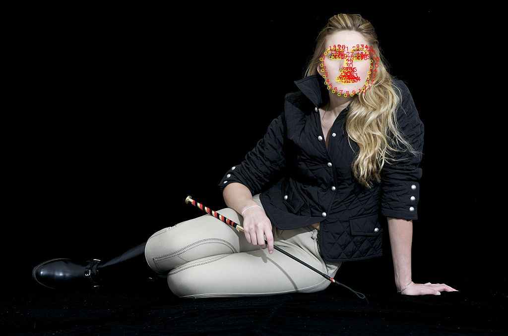
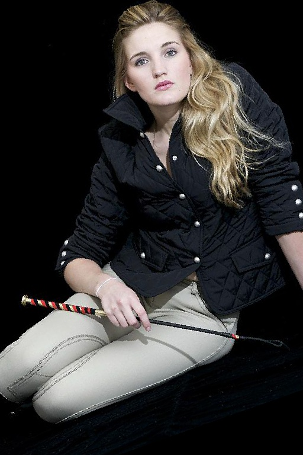
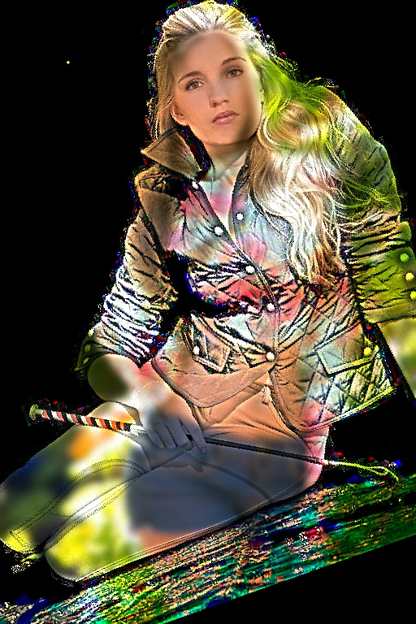
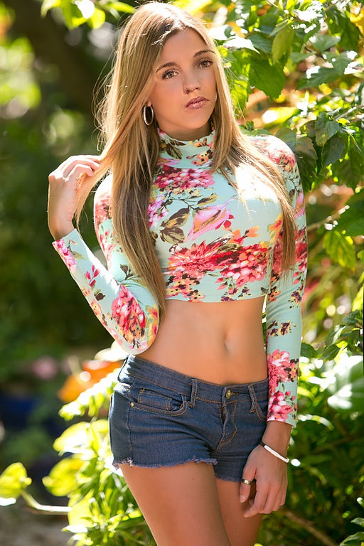

# Face Swapping

This notebook is a small extract from the udacity AI computer vision course and demonstrates the ability to swap faces using numpy, dlib and OpenCV. (Original article on [reddit](https://www.reddit.com/r/programming/comments/3f591x/so_i_wrote_a_script_that_swaps_peoples_faces_in/) by Matthew Earl)

Note: The sample images are downloaded from wikimedia.org (see the attached license file). Code and notebook are MIT License.

The transformation process can be break down into four steps:

1. Detecting facial landmarks using _dlib_

<table><tr><td></td>
<td></td></tr></table>

## 2. Align faces with a procrustes analysis

<table><tr><td></td>
<td></td></tr></table>

## 3. Blending face features together

<table><tr><td></td>
<td></td></tr></table>

## 4. Color correction and final output

<table><tr><td><td></td>
<td></td></tr></table>

Further instructions can be found in the notebook.