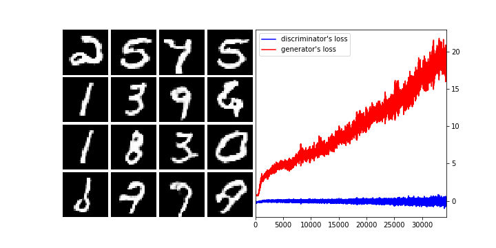

# Mnist-DCGAN-for-Tensorflow
simple Tensorflow scripts for DCGAN proposed by [Radford et al. (2015)](https://arxiv.org/abs/1511.06434) using [the MNIST database](http://yann.lecun.com/exdb/mnist/). 

## Result

